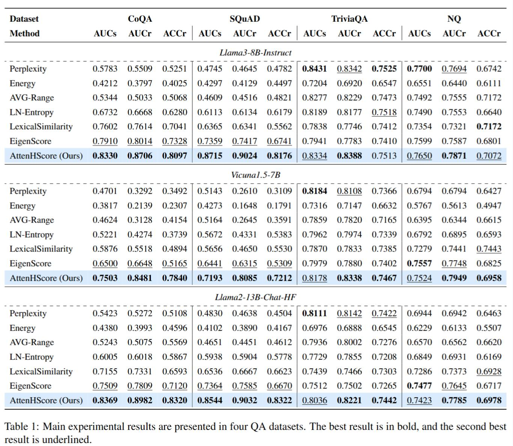
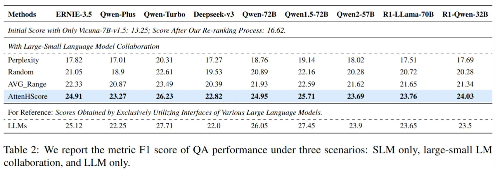

<h1 align="center">
    Invoke Interfaces Only When Needed: Adaptive Invocation for Large Language Models in Question Answering
</h1>
<p align="center">
    <a href="https://arxiv.org/abs/2505.02311">
        
    </a>
    <a href="https://huggingface.co/papers/2505.02311">
        
    </a>
    <a href="https://opensource.org/license/apache-2-0">
        
    </a>
</p>

**🎯 Who Should Pay Attention to Our Work?**

- Researchers in the field of hallucination detection: The paper introduces **a novel invocation discriminant metric, AttenHScore**, for detecting hallucinations in SLMs.    
- Developers working with LLMs and SLMs: The proposed methods aim to balance performance and cost in **collaborative LLM-SLM systems**. The strategies presented **eliminate the need for additional model training and are designed to be plug-and-play for various transformer-based LMs**, which could be highly beneficial for practical applications.    
- Individuals working on QA systems and RAG: The paper specifically tests its methods on multiple QA datasets and within a RAG context.  The **re-ranking strategy** based on uncertainty evaluation is designed to **help SLMs better capture critical information** and enhance accuracy in QA tasks.    
- Organizations looking to optimize resource allocation in AI systems: The collaborative paradigm of large and small LMs aims for **optimal resource allocation and efficient task processing** by leveraging the strengths of both types of models.    


## Quick Start

- Install dependency packages

```bash
pip install -r requirements.txt
```

- Start the milvus-lite service (vector database)

```bash
milvus-server
```

- Download models to corresponding directories.

- Modify *_settings.py* according to your need.

- Overall results of the hallucination detection component.

```bash
nohup python -m pipeline.generate \
  --model Meta-Llama-3-8B-Instruct \
  --dataset coqa \
  --device 'cuda:3' \
  --num_generations_per_prompt 10 \
  --temperature 0.5 \
  --top_p 0.99 \
  --top_k 10 \
  --fraction_of_data_to_use 1 \
  --project_ind 0 \
  >> nohup_llama3_8B_coqa.log 2>&1 &

# Performance evaluation
python func/evalFunc.py
```

- Collaborative performance of LLMs and SLMs in QA.

SLM Retrieval-Based QA System
```bash
CUDA_VISIBLE_DEVICES=7 nohup python retrieval.py \
  --data_path 'data/multifieldqa_zh.jsonl' \
  --save_file 'qa_nodie/multifieldqa_zh_qwen2_7B_Chunks.json' \
  --docs_path 'data/chunking/multifieldqa_zh_qwen2_7B_Chunks.json' \
  --collection_name 'multifieldqa_zh_qwen2_7B_Chunks \
  --retrieve_top_k 5 \
  --construct_index \
  >> qa_nodie/multifieldqa_zh_qwen2_7B_Chunks_top5.log 2>&1 &
```

LLM Interface QA System
```bash
nohup python tollms_retrieval.py >> qa_nodie/dataset_yiyan.log 2>&1 &
```

Large-Small LM Collaboration in QA System
```bash
CUDA_VISIBLE_DEVICES=1,2 nohup python judge.py >> qa_nodie/multifieldqa_zh_top10.log 2>&1 &

# Performance evaluation
python eval.py
```

## Results

We first conduct a comprehensive evaluation of the key component for detecting hallucinations in SLMs within the collaborative system of large-small LM on hallucination benchmarks. Subsequently, we integrate AttenHScore into the entire system and evaluate its accuracy in determining interface calls by comparing various real-time hallucination detection methods.




